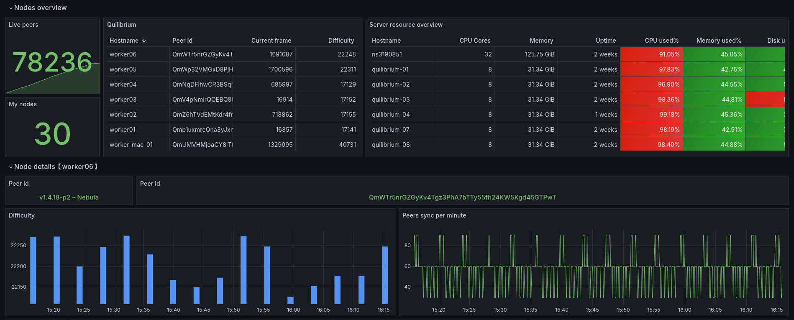

# Quilibrium Dashboard

This project allows you to monitor your Quilibrium nodes directly in Grafana, providing the necessary information and facilitating tracking.



## Prerequisites

It is preferable to have your own Grafana server for monitoring your nodes. If you have a few nodes (maximum 5), you can use Grafana Cloud which will provide you with the necessary stack (https://grafana.com/)[https://grafana.com/]

To make the dashboard work, you need:
* Grafana (dashboard)
* Victoria Metrics (metrics service)
* Loki (logs service)

## Installing Grafana / Victoria Metrics / Loki

You have multiple choices to create your Grafana instance:

* Use Grafana Cloud: they provided a limited free plan
* Use the provided Docker image to create your own Grafana instance
1. Install Docker
```
# Add Docker's official GPG key:
sudo apt-get update
sudo apt-get install ca-certificates curl
sudo install -m 0755 -d /etc/apt/keyrings
sudo curl -fsSL https://download.docker.com/linux/ubuntu/gpg -o /etc/apt/keyrings/docker.asc
sudo chmod a+r /etc/apt/keyrings/docker.asc

# Add the repository to Apt sources:
echo \
  "deb [arch=$(dpkg --print-architecture) signed-by=/etc/apt/keyrings/docker.asc] https://download.docker.com/linux/ubuntu \
  $(. /etc/os-release && echo "$VERSION_CODENAME") stable" | \
  sudo tee /etc/apt/sources.list.d/docker.list > /dev/null
sudo apt-get update

sudo apt-get install docker-ce docker-ce-cli containerd.io docker-buildx-plugin docker-compose-plugin
```
2. Install Docker image
```
cd
mkdir grafana
cd grafana
wget https://raw.githubusercontent.com/fpatron/Quilibrium-Dashboard/master/grafana/docker/docker-compose.yml
sudo docker compose up -d
```
* Create your own Grafana instance on a VM or server of your choice

## Prepare each node

### Prerequisites

### **<span style="color:red">IMPORTANT</span>** 

The dashboard needs Quilibrium logs to function. To do this, your node must run as a service.

#### Use Cases

* If you use a service and your service is named Quilibrium, you don't need to do anything.
* If you use a service and your service is not named Quilibrium: you can create a .env file into the exporter directory and override the default name using this parameter `service_name`
* If you use screen to run your node, you must use a service to run your node because the Grafana dashboard is not optimized for managing screens.

As root, create the file `/lib/systemd/system/quilibrium.service`with the following content:
```
sudo nano /lib/systemd/system/quilibrium.service
```

```
[Unit]
Description=Quilibrium node
[Service]
Type=simple
RestartSec=10s
WorkingDirectory=/home/<username>/quilibrium/ceremonyclient/node
ExecStart=/home/<username>/quilibrium/ceremonyclient/node/release_autorun.sh
User=<username>
[Install]
WantedBy=multi-user.target
```

Replace the WorkingDirectory, ExecStart, and User tags with the correct values.

Reload the configuration:
```
sudo systemctl daemon-reload
sudo systemctl enable quilibrium
```

Usage examples:

```
# Start the node:
sudo systemctl start quilibrium
# Stop the node:
sudo systemctl stop quilibrium
# Restart the node:
sudo systemctl restart quilibrium
# Follow the logs:
journalctl -u quilibrium -f
```

Note: Your node will now start automatically in case of a crash and at every server reboot.

### Installing the Quilibrium node exporter

It is necessary to install the custom node exporter on each node you want to monitor in order to send custom metrics:

* Create a directory `exporter`in the root of Quilibrium node (ie: `/home/user/quilibrium/exporter`)
* Copy the files [quilibrium_exporter.py](grafana/exporter/quilibrium_exporter.py) [requirements.txt](grafana/exporter/requirements.txt) into
* Go to your node directory (/home/user/quilibrium/ceremonyclient/node for ie)
* Prepare python environment
```
sudo apt install python3 python3-pip python3-virtualenv
mkdir -p ~/quilibrium/exporter
cd ~/quilibrium/exporter
virtualenv venv
source venv/bin/activate
pip install -r requirements.txt
```
* Create a dedicated service to launch the exporter at runtime (see file [quilibrium_exporter.service](grafana/exporter/quilibrium_exporter.service))
* Copy the file into /lib/systemd/system (adapt with your needs)
* Enable the service:
```
sudo systemctl daemon-reload
sudo systemctl enable quilibrium_exporter
sudo systemctl start quilibrium_exporter
```

### Installing Grafana Alloy

It is necessary to install the Grafana Alloy agent on your nodes. It will be responsible for reporting your server metrics (CPU, RAM, disk...) and the Quilibrium node logs.

To install it, run these commands:
```
wget -q -O - https://apt.grafana.com/gpg.key | gpg --dearmor | sudo tee /etc/apt/keyrings/grafana.gpg > /dev/null                              
echo "deb [signed-by=/etc/apt/keyrings/grafana.gpg] https://apt.grafana.com stable main" | sudo tee /etc/apt/sources.list.d/grafana.list
sudo apt update
sudo apt-get install alloy -y

```

### Configuring Grafana Alloy

Once the agent is installed, you need to configure it.
The configuration file is located here:
```
/etc/alloy/config.alloy
```
Delete its contents and replace them with the contents of the example file [grafana/alloy/config.alloy](grafana/alloy/config.alloy)

Replace the following tags with your own information:

* <PROMETHEUS_ENDPOINT> (eg: http://X.X.X.X:9090/api/v1/write)
* <PROMETHEUS_USERNAME> (optional)
* <PROMETHEUS_PASSWORD> (optional)

* <LOKI_ENDPOINT> (eg:  http://X.X.X.X:3100/loki/api/v1/push)
* <LOKI_USERNAME> (optional)
* <LOKI_PASSWORD> (optional)

If you use the Grafana Cloud suite, you will need to generate an API key for Prometheus and Loki.
Replace the Prometheus and Loki passwords with this key.


## Importing the Dashboard

Go to your Grafana instance


1. Install the Infinity plugin
    * Go to Home > Administration > Plugins and data > Plugins
    * Note: By default, only installed plugins are displayed. Switch to "All" mode (top right).
    * Search for the Infinity plugin and install it

2. Add a datasource for Infinity, Loki and Prometheus
    * Go to Home > Data sources
    * Click on the "Add new data sources" button
    * Search for "Infinity"
    * Click on "Save & test"
    * Click on the "Add new data sources" button
    * Search for "Prometheus"
    * Connection : Prometheus URL : http://192.168.X.X:9090    (put the IP of the computer running docker)
    * Click on "Save & test"
    * Click on the "Add new data sources" button
    * Search for "Loki"
    * Connection : URL : http://192.168.X.X:3100             (put the IP of the computer running docker)
    * Click on "Save & test"

3. Import the dashboard
    * Go to Home > Dashboard
    * Download the dashboard in [JSON format](https://raw.githubusercontent.com/fpatron/Quilibrium-Dashboard/master/grafana/dashboard/quilibrium-dashboard.json)
    * Click on the "New" > "Import" button
    * Upload the dashboard in JSON format
    * Select the various datasources


Once everything is set up, wait at least 30 minutes to get good metrics on your dashboard :)

That's all! Enjoy!
