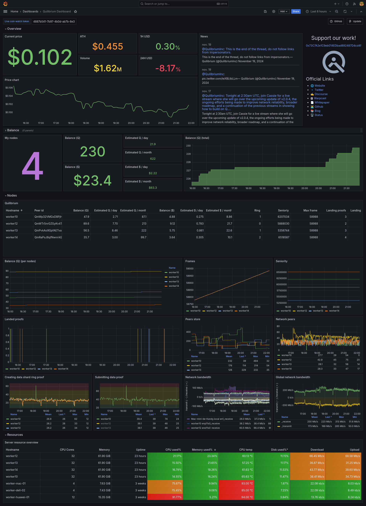

# Quilibrium Dashboard

This project allows you to monitor your Quilibrium nodes directly in Grafana, providing the necessary information and facilitating tracking.



## Prerequisites

It is preferable to have your own Grafana server for monitoring your nodes. If you have a few nodes (maximum 5), you can use Grafana Cloud which will provide you with the necessary stack (https://grafana.com/)[https://grafana.com/]

To make the dashboard work, you need:
* Grafana (dashboard)
* Prometheus (metrics service)
* Loki (logs service)

## Installing Grafana / Prometheus / Loki

You have multiple choices to create your Grafana instance:

* Use Grafana Cloud: they provided a limited free plan
* Use the provided Docker image to create your own Grafana instance
* Create your own Grafana instance on a VM or server of your choice

Tips: Prometheus server needs to be launch with the following flags:

`--web.enable-remote-write-receiver`

## Prepare each node

### Installing the Quilibrium node exporter

It is necessary to install the custom node exporter on each node you want to monitor in order to send custom metrics:

* Create a directory `exporter`in the root of Quilibrium node (ie: `/home/user/quilibrium/exporter`)
* Copy the files [quilibrium_exporter.py](grafana/exporter/quilibrium_exporter.py) [requirements.txt](grafana/exporter/requirements.txt) into
* Go to your node directory (/home/user/quilibrium/ceremonyclient/node for ie)
* Execute this command
```
ln -s ./node-1.4.19-linux-amd64 ./node
```
* Prepare python environment
```
sudo apt install python3 python3-pip python3-virtualenv
cd ~/quilibrium/exporter
virtualenv venv
source venv/bin/activate
pip install -r requirements.txt

```
* Create a dedicated service to launch the exporter at runtime (see file [quilibrium_exporter.service](grafana/exporter/quilibrium_exporter.service))
* Copy the file into /lib/systemd/system (adapt with your needs)
* Enable the service:
```
systemctl daemon-reload
systemctl enable quilibrium_exporter.service
systemctl start quilibrium_exporter.service
```

### Installing Grafana Alloy

It is necessary to install the Grafana Alloy agent on your nodes. It will be responsible for reporting your server metrics (CPU, RAM, disk...) and the Quilibrium node logs.

To install it, run these commands:
```
wget -q -O - https://apt.grafana.com/gpg.key | gpg --dearmor | sudo tee /etc/apt/keyrings/grafana.gpg > /dev/null                              
echo "deb [signed-by=/etc/apt/keyrings/grafana.gpg] https://apt.grafana.com stable main" | sudo tee /etc/apt/sources.list.d/grafana.list
sudo apt update
sudo apt-get install alloy -y

```

### Configuring Grafana Alloy

Once the agent is installed, you need to configure it.
The configuration file is located here:
```
/etc/alloy/config.alloy
```
Delete its contents and replace them with the contents of the example file [grafana/alloy/config.alloy](grafana/alloy/config.alloy)

Replace the following tags with your own information:

* <PROMETHEUS_ENDPOINT> (eg: http://X.X.X.X:9090/api/v1/write)
* <PROMETHEUS_USERNAME> (optional)
* <PROMETHEUS_PASSWORD> (optional)

* <LOKI_ENDPOINT> (eg:  http://X.X.X.X:3100/loki/api/v1/push)
* <LOKI_USERNAME> (optional)
* <LOKI_PASSWORD> (optional)

If you use the Grafana Cloud suite, you will need to generate an API key for Prometheus and Loki.
Replace the Prometheus and Loki passwords with this key.


### **<span style="color:red">IMPORTANT</span>** 

By default, the example configuration retrieves the Quilibrium node logs in your server's logs.
This only works if you run your node with a service (systemctl).

#### Use Cases

* If you use a service and your service is named Quilibrium, you don't need to do anything.
* If you use a service and your service is not named Quilibrium, rename the service to quilibrium.service and reload the configuration:
```
systemctl daemon-reload
```
* If you use screen to run your node, you now need to use a service to run your node because the Grafana dashboard is not optimized for managing screens.

As root, create the file `/lib/systemd/system/quilibrium.service`with the following content:

```
[Unit]
Description=Quilibrium node
[Service]
Type=simple
Restart=always
RestartSec=5s
WorkingDirectory=/home/user/quilibrium/ceremonyclient/node
Environment="GOMAXPROCS=8"
Environment=GOEXPERIMENT=arenas
ExecStart=/home/user/quilibrium/ceremonyclient/node/node-1.4.18-linux-amd64
User=user
[Install]
WantedBy=multi-user.target
```

Replace the WorkingDirectory, ExecStart, and User tags with the correct values.

Reload the configuration:
```
systemctl daemon-reload
```

Usage examples:

* Start the node:
```
systemctl start quilibrium
```
* Stop the node:
```
systemctl stop quilibrium
```
* Restart the node:
```
systemctl restart quilibrium
```
* Follow the logs:
```
journalctl -u quilibrium -f
```

Note: Your node will now start automatically in case of a crash and at every server reboot.

## Importing the Dashboard

Go to your Grafana instance


1. Install the Infinity plugin
    * Go to Home > Administration > Plugins and data > Plugins
    * Search for the Infinity plugin and install it
    * Note: By default, only installed plugins are displayed. Switch to "All" mode.
2. Add a datasource for Infinity
    * Go to Home > Data sources
    * Click on the "Add new data sources" button
    * Search for "Infinity"
    * Click on "Save & test"
3. Import the dashboard
    * Go to Home > Dashboard
    * Download the dashboard in [JSON format](https://raw.githubusercontent.com/fpatron/Quilibrium-Dashboard/master/grafana/dashboard/quilibrium-dashboard.json)
    * Click on the "New" > "Import" button
    * Upload the dashboard in JSON format
    * Select the various datasources


That's all! Enjoy!
